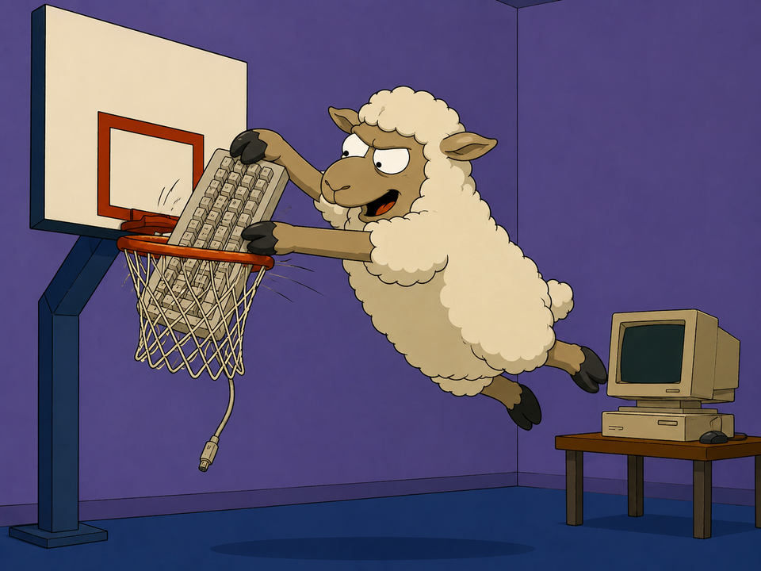

# Dunking Sheep 🐑

A terminal-first automation tool that sends text to **herdr** panes at regular
intervals. Perfect for keeping coding agents engaged with prompts like
"continue" or "keep going" — without touching your keyboard or fighting window
focus.

Dunking Sheep is a [herdr](https://herdr.dev)-native sibling of
[Dunking Bird](../dunkingbird). It has the same TUI and the same features, but
instead of capturing an OS window and typing through `ydotool`, it targets a
herdr **pane** and delivers text over herdr's socket API. You run it as a
process in a herdr tab and point it at your agent panes.

## 🎬 Demo

<!--
  GitHub plays a video INLINE only when the URL is a github.com/user-attachments
  asset. To upgrade the embed below to true inline playback:
    1. Open https://github.com/huntergdavis/dunkingsheep/issues/new
    2. Drag dunkingsheep-demo.mp4 into the comment box and wait for it to upload
    3. Copy the .../user-attachments/assets/<uuid> URL GitHub inserts
    4. Replace the <video src="..."> below with that URL (you can close the issue)
  Until then the poster below links straight to the raw .mp4 (click to play).
-->

<video src="https://raw.githubusercontent.com/huntergdavis/dunkingsheep/main/dunkingsheep-demo.mp4"
       poster="https://raw.githubusercontent.com/huntergdavis/dunkingsheep/main/dunkingsheep-poster.png"
       width="900" controls muted playsinline>
  <a href="https://raw.githubusercontent.com/huntergdavis/dunkingsheep/main/dunkingsheep-demo.mp4">▶ Watch the demo</a>
</video>

[▶ **Watch the demo**](https://raw.githubusercontent.com/huntergdavis/dunkingsheep/main/dunkingsheep-demo.mp4) — picking an agent pane from the workspace-grouped target list and dunking on it.

## Why a herdr version?

Dunking Bird drives the OS input layer: capture a window, re-focus it, type with
`ydotool`, and babysit the `ydotoold` daemon and its socket permissions. Inside
herdr none of that is necessary — herdr already owns your terminals and exposes
them by id. Dunking Sheep just says *"send this text to pane `w1:p3`"* and
herdr does it. No focus stealing, no `sudo`, no daemon.

## ✨ Features

- **🎯 Pane targeting** — pick any herdr pane from a live list (shows the agent
  running in it and its status)
- **🐑 Multiple dunkers** — run many senders at once, each with its own target,
  interval, and text
- **⏱️ Configurable interval** — per dunker, in minutes
- **📝 Custom text** — full-screen editor for the text each dunker sends
- **🔄 Automatic Enter** — text is sent, then Enter is pressed
- **⏰ Live countdown** — see `Next: MM:SS` until the next send
- **🧪 Test send** — fire a single send now, with a short countdown
- **🖥️ Runs in a herdr tab** — no GUI, no OS input plumbing

## 📋 Requirements

- **Python 3.6+** (standard library only — no `pip install` needed)
- **[herdr](https://herdr.dev)** installed with a running server
  (`herdr` on `PATH` or at `~/.local/bin/herdr`)

Check herdr is up:

```bash
herdr status server        # should report status: running
```

## 🚀 Usage

Open a tab in herdr and run:

```bash
./run_dunking_sheep.sh
# or
python3 dunking_sheep_tui.py
```

Then:

1. **Pick a target** — press `c` to open the pane picker. It's grouped by
   workspace, with each workspace's tabs indented beneath its name and shown as
   columns (Tab · Agent · Status · Directory), so it's easy to tell them apart:

   ```
   zoomies
       Tab               Agent    Status    Directory
       OpenAI            codex    idle      /home/hunter
       Zoomies PS1       claude   done      /home/hunter/workspace/pspsps-engine
   dunkingsheep
       dunking sheep     claude   working   /home/hunter/workspace/dunkingsheep
   ```

   Move with `j`/`k` or the arrow keys, `Enter` selects, `Esc` cancels.
2. **Set the interval** — press `i`, type minutes (e.g. `10`), `Enter` saves.
3. **Set the text** — press `e` for the full-screen editor. `Ctrl+G` saves,
   `Esc` cancels. Default is `continue`.
4. **Test it** — press `t` to send once immediately (2-second countdown).
5. **Start** — press `Space` (or `s`) to begin. The status shows the live
   countdown. Press `Space`/`s` again to stop.
6. **More dunkers** — `a` adds one, `d` removes the selected one.
7. **Quit** — `q` or `Esc`.

### Keybindings

| Key | Action |
| --- | --- |
| `j` / `k` / ↑ / ↓ | Move selection |
| `a` | Add a dunker |
| `d` | Remove selected dunker |
| `c` | Choose target pane |
| `t` | Test send now |
| `i` | Edit interval (minutes) |
| `e` | Edit text to send |
| `Space` / `s` | Start / stop |
| `q` / `Esc` | Quit |

## 🧩 How it works

Dunking Sheep shells out to the `herdr` CLI, which talks to the herdr server
over its unix socket:

```
herdr pane list                          # discover targets
herdr pane send-text <pane_id> <text>    # type the text
herdr pane send-keys <pane_id> Enter     # press Enter
```

That's the whole transport. See [`docs/DESIGN.md`](docs/DESIGN.md) for the
architecture and [`docs/RESEARCH.md`](docs/RESEARCH.md) for the study of Dunking
Bird and the herdr API that this port is based on.

## 💡 Example: keep a coding agent moving

1. In herdr, start your agent (e.g. Claude Code, Codex) in a tab.
2. In another herdr tab, run `./run_dunking_sheep.sh`.
3. Press `c`, select the agent's pane.
4. Set interval to `15`, text to `continue with the implementation`.
5. Press `Space`. The agent gets a nudge every 15 minutes.

## 🔧 Troubleshooting

**Status shows "herdr server not running - start herdr"**
Start herdr (run `herdr`) so its server is up, then relaunch Dunking Sheep.
Verify with `herdr status server`.

**Status shows "herdr not found - install herdr"**
Install herdr and make sure `herdr` is on `PATH` (or at `~/.local/bin/herdr`).
See https://herdr.dev.

**Picker says "No herdr panes"**
The server is reachable but reports no panes. Open a tab/pane in herdr first.

**Send failed**
The target pane may have been closed. Press `c` and re-select a live pane.

## 📄 Files

| File | Purpose |
| --- | --- |
| `dunking_sheep_tui.py` | The curses TUI and dunker timers |
| `herdr_client.py` | Wrapper around the `herdr` CLI (the transport) |
| `run_dunking_sheep.sh` | Launcher |
| `docs/RESEARCH.md` | Study of Dunking Bird + the herdr API |
| `docs/DESIGN.md` | Architecture and the Bird→Sheep mapping |

---

*Dunking Sheep is to herdr what Dunking Bird is to your desktop. 🐑*

---

<p align="center">
  <br>
  <sub><em>required AI slop</em></sub>
</p>
